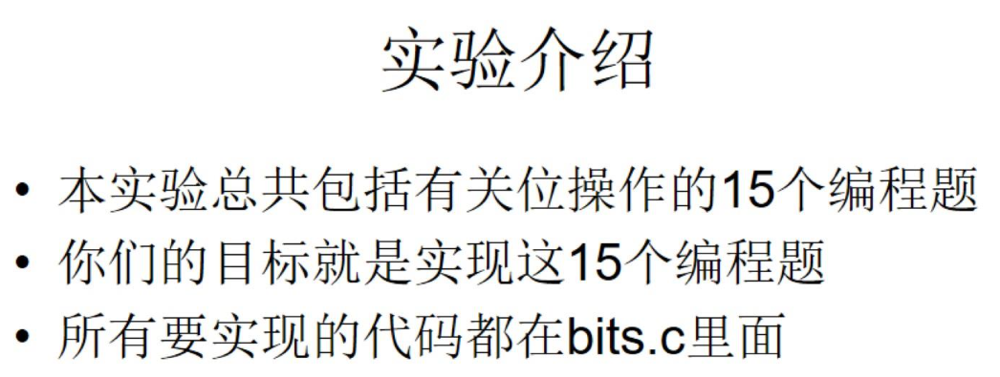

# csapp-exp
This project was built to record the experiment implementation of my csapp course taught by Professor Junmin Wu.

## Table of Contents
- [Built With](#built-with)
- [Maintainers](#maintainers)

## Built With
* [GCC](https://gcc.gnu.org/) - the GNU Compiler Collection.
* [GDB](https://www.gnu.org/software/gdb/) - The GNU Project Debugger.

## Maintainers
[@DixinFan](https://github.com/DixinFan). 
Something not working as expected? Feel free to open an issue.

